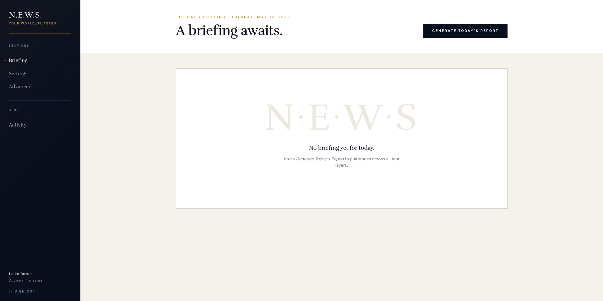

# N.E.W.S.

Your personal AI news assistant. Set your location and interests, get a daily briefing.



## Requirements

- [Docker Desktop](https://www.docker.com/products/docker-desktop/)
- A terminal

## Setup

```bash
git clone https://github.com/isaka-james/n.e.w.s
cd n.e.w.s
cp .env.example .env
```

Open `.env` and fill in your API keys:

| Key | Sign up | Free tier |
|---|---|---|
| `DEEPSEEK_API_KEY` | https://platform.deepseek.com | Pay-as-you-go |
| `NEWSDATA_API_KEY` | https://newsdata.io/register | 200 req/day |
| `NEWSAPI_API_KEY` | https://newsapi.org/register | 100 req/day |
| `NEWSCATCHER_API_KEY` | https://www.newscatcherapi.com | Pay-as-you-go |
| `GNEWS_API_KEY` | https://gnews.io/signup | 100 req/day |
| `GUARDIAN_API_KEY` | https://open-platform.theguardian.com/access/ | 500 req/day |
| `NYTIMES_API_KEY` | https://developer.nytimes.com/accounts/create | 4000 req/day |

Generate a `JWT_SECRET_KEY`:

```bash
openssl rand -hex 32
```

Leave the database section as-is.

## Run

```bash
docker compose up -d --build
```

Open http://localhost:4291, register, and press **Generate today's report**.

## Use it from other devices on the same network

The frontend is built to use a relative API path, so any device on the same
WiFi can use the app — phones, tablets, other laptops.

1. Find your host's LAN IP (Linux/Mac: `ip addr` or `hostname -I` · Windows: `ipconfig`).
2. From another device on the same WiFi, open `http://<your-ip>:4291`
   (for example `http://192.168.1.5:4291`).

If your machine has a firewall (UFW, Windows Defender, macOS firewall), allow
inbound TCP on port `4291`. Example for UFW:

```bash
sudo ufw allow 4291/tcp
```

## Stop

```bash
docker compose down
```

## Screenshots

See [img/README.md](img/README.md).

## Technical docs

See [TECHNICAL.md](TECHNICAL.md).

## License

MIT. Built by [Isaka James](https://github.com/isaka-james).
