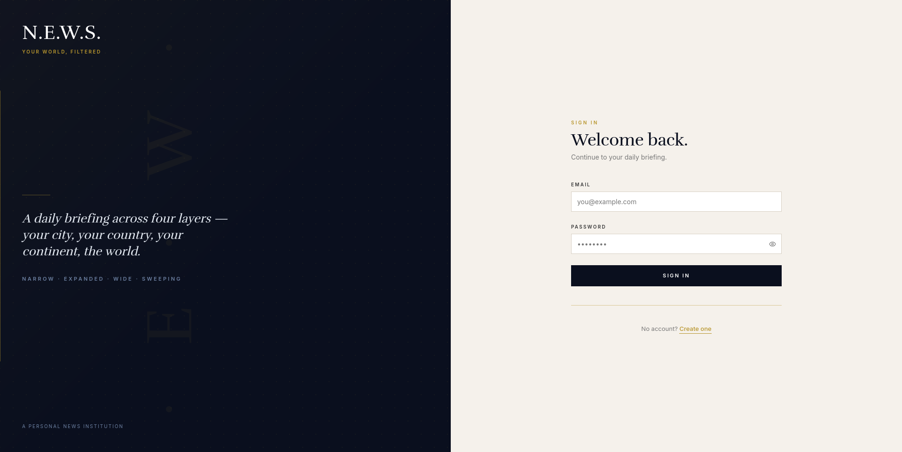
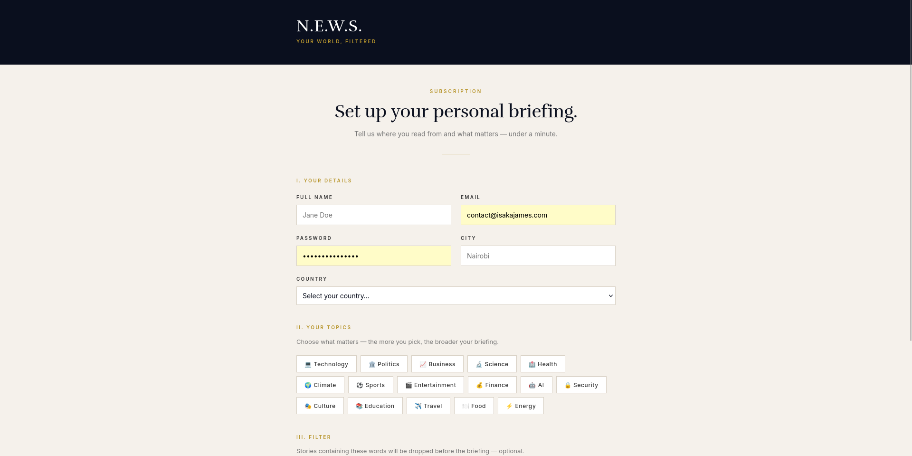
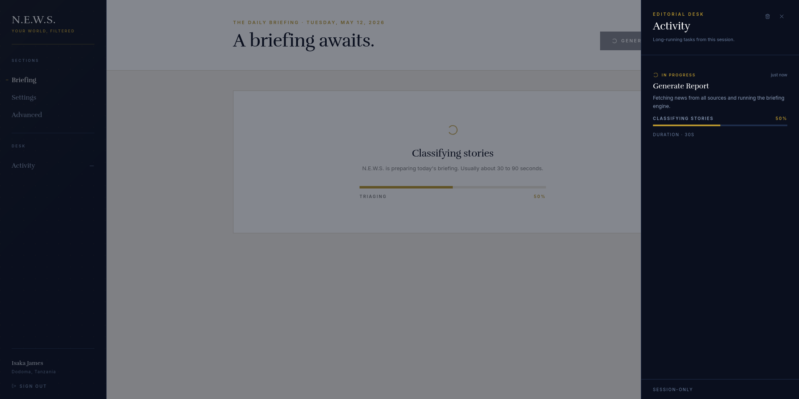
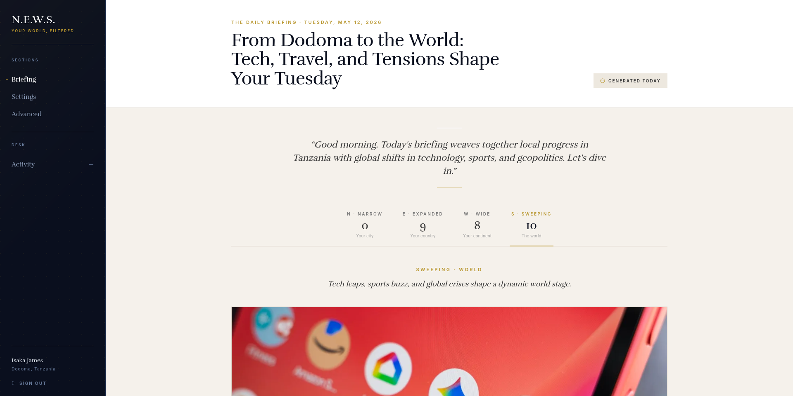
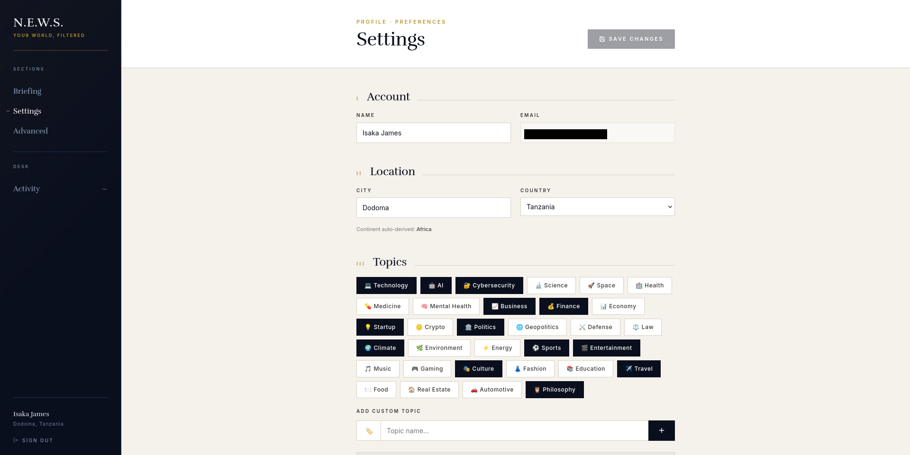
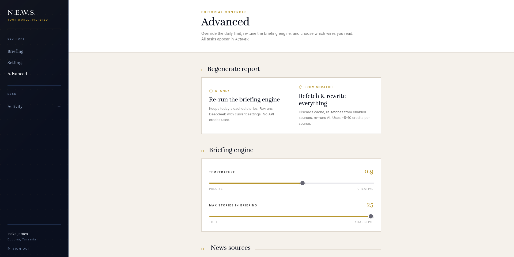

# Screenshots

A tour of N.E.W.S. as it looks today. Each shot maps to one page in the app.

## Sign in

The entry point. The left panel is the brand mark and a short statement of what the app does. The right panel is a plain email + password form. New users follow the "Create one" link to the registration flow.

## Register

Set up the briefing in one minute. Three groups of fields:

1. Your details: name, email, password, city, country. The continent is auto-derived from country on the backend.
2. Your topics: pick from a curated grid (Technology, Politics, Business, Science, Health, Climate, Sports, Entertainment, Finance, AI, Security, Culture, Education, Travel, Food, Energy). Picks become high-priority tags.
3. Filter: a comma list of words that will drop any story containing them, before the briefing is written.

## Dashboard, empty state

What you see when there is no briefing for today yet. The center stage holds the N.E.W.S. wordmark and a single call to action. The left rail is the global navigation: Briefing, Settings, Advanced, and the Activity desk that tracks running jobs. The user's name, city and country sit at the bottom of the rail.

Press "Generate today's report" and the engine begins.

## Dashboard, generating

The progress card that replaces the empty state while the briefing engine runs. A step indicator walks through each stage: fetching from news sources, triaging articles, and writing with DeepSeek. The Activity desk on the left rail mirrors the same job in real time. The page polls automatically and transitions to the finished briefing the moment it lands.

## Dashboard, briefing ready

The finished daily briefing. Stories are grouped by the N–E–W–S compass quadrants (National, Eastern/international, World trends, Special interest) and rendered as cards with headline, source, publication time, and a concise AI-written summary. A gold accent marks the active quadrant tab. The user can scroll the full briefing or jump between sections using the tab bar.

## Settings

Profile and preferences. The Account block holds name and email. Location holds city and country, with the continent shown read-only below them. Topics is the same grid used at registration, plus an "Add custom topic" input below the grid for niche tags (Philosophy, Real Estate, Automotive in this shot). Selected topics are filled in dark; unselected are outlined.

Further down the page (not shown in this crop) are priority controls per topic, the blocked-words list, and the auto-generate time picker.

## Advanced

Editorial controls for the briefing engine.

- Regenerate report: two paths. "AI only" re-runs DeepSeek on today's already-cached stories with whatever current settings you have; it costs no provider credits. "From scratch" wipes the cache and re-fetches from every enabled source before re-writing.
- Briefing engine: temperature slider (Precise to Creative) and a max-stories-per-briefing slider (Tight to Exhaustive).
- News sources: toggle individual providers on or off. Useful when one of them is rate-limited or returns junk for your region.

All tasks kicked off from this page appear in the Activity desk on the left rail.

## Visual language

- Serif display: Rufina, used for headlines, the wordmark, and pull quotes.
- Body text: a neutral sans serif at small sizes with wide letter-spacing in uppercase labels.
- Palette: deep navy on the left rail, off-white parchment on the main canvas, and a single gold accent (#b8962e) for labels, links, and active states.
- One column at a time. Tabs and side rails carry navigation; the canvas stays focused on the current task.
